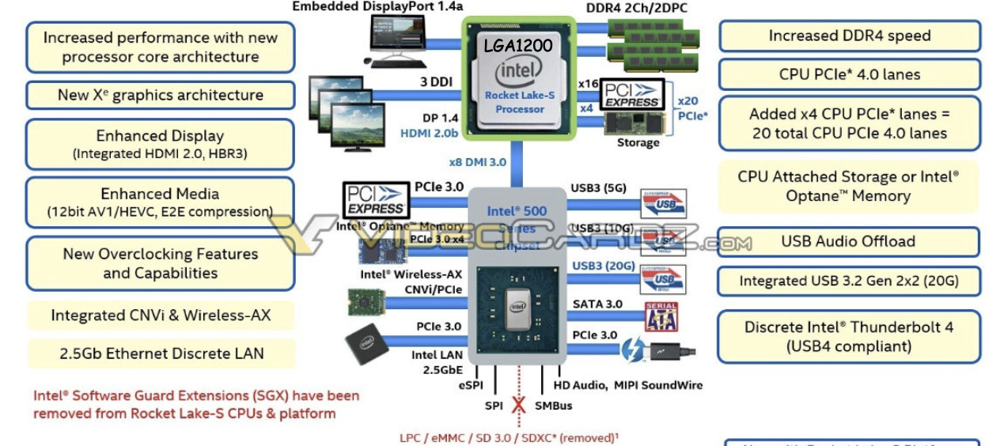

# Tema 1-1: Fundamentos y Principios del Diseño de Computadores

## Índice de Contenidos

- [Tema 1-1: Fundamentos y Principios del Diseño de Computadores](#tema-1-1-fundamentos-y-principios-del-diseño-de-computadores)
  - [Índice de Contenidos](#índice-de-contenidos)
  - [Niveles en un Computador](#niveles-en-un-computador)
  - [Concepto de Arquitectura de Computadores](#concepto-de-arquitectura-de-computadores)
  - [Requerimientos Funcionales de los Computadores](#requerimientos-funcionales-de-los-computadores)
  - [Tipos de Computadores](#tipos-de-computadores)
  - [Organización de la Placa Base](#organización-de-la-placa-base)
  - [Tipos de Procesadores](#tipos-de-procesadores)
  - [Últimas tendencias en los procesadores](#últimas-tendencias-en-los-procesadores)
  - [Arquitectura del repertorio de instrucciones](#arquitectura-del-repertorio-de-instrucciones)
  - [Medidas de Prestaciones: tiempo ejecución, speed-up, CPI, Ley de Amdahl](#medidas-de-prestaciones-tiempo-ejecución-speed-up-cpi-ley-de-amdahl)
  - [Benchmarks: medias aritmética y geométrica, SPEC](#benchmarks-medias-aritmética-y-geométrica-spec)
  - [Ranking de computadores](#ranking-de-computadores)
  - [Problemas](#problemas)

## Niveles en un Computador
## Concepto de Arquitectura de Computadores
## Requerimientos Funcionales de los Computadores

**Placa Base (Intel serie 500)**

Dos conjuntos de chipsets:

- Procesador
- Puente Sur

## Tipos de Computadores
## Organización de la Placa Base
## Tipos de Procesadores
## Últimas tendencias en los procesadores
## Arquitectura del repertorio de instrucciones
## Medidas de Prestaciones: tiempo ejecución, speed-up, CPI, Ley de Amdahl
## Benchmarks: medias aritmética y geométrica, SPEC
## Ranking de computadores
## Problemas
